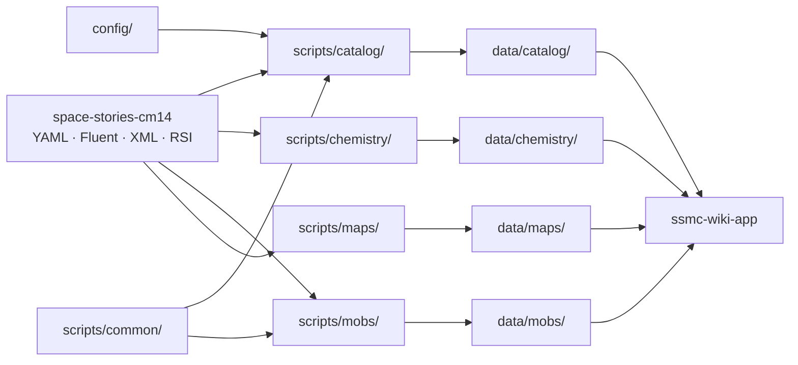

# SSMC Wiki Data

Сборщики данных для веб-инструментов **Space Stories Marine Corps**. Репозиторий
читает прототипы игры, локализацию и RSI-ресурсы, преобразует их в стабильные
JSON-контракты и сохраняет готовые данные в `data/`.

Сгенерированные файлы не редактируются вручную. Источниками истины являются код
сборщиков, конфигурация и конкретный commit игрового репозитория.

Полное руководство по совместной разработке data и app находится в
[`ssmc-wiki-app/docs/CONTRIBUTOR_GUIDE.md`](https://github.com/DeferW/ssmc-wiki-app/blob/main/docs/CONTRIBUTOR_GUIDE.md).

## Архитектура



Каждый предметный модуль изолирован в `scripts/<module>/` и пишет только в
`data/<module>/`. Общие чтение прототипов и Fluent-локализация находятся в
`scripts/common/`. Модуль химии использует собственный YAML loader, потому что
его промежуточный формат отличается от Entity-прототипов каталога и мобов.

```text
config/                     редактируемая конфигурация каталога
scripts/
  common/                   общий resolver прототипов и локализация
  catalog/                  каталог предметов
  chemistry/                реагенты, реакции и guidebook
  mobs/                     параметры людей и каст ксеноморфов
  maps/                     активные карты, маркеры, спавнеры и WebP-тайлы
data/
  catalog/                  публичный каталог, диагностика и PNG
  chemistry/                публичный каталог и промежуточные индексы
  mobs/                     публичный каталог мобов
  maps/                     каталог карт и лениво загружаемые данные каждой карты
.github/workflows/          сборка, публикация и PR-проверки
```

Новый независимый сборщик добавляется по той же схеме:
`scripts/<module>/`, `data/<module>/`, тесты, валидатор и отдельный workflow.
Связывать его напрямую с другим предметным модулем не следует; повторяемую
инфраструктуру нужно вынести в `scripts/common/`.

## Каталог предметов

### Конвейер

1. `config/catalog-sources.yml` перечисляет разрешённые автоматы и компьютеры
   карго. Автоматического поиска по префиксу нет: новый источник не попадёт в
   каталог без явного добавления.
2. Сборщик читает торговые предложения и заказы карго.
3. От каждого найденного предмета выполняется обход графа: содержимое ящиков и
   наборов, слоты, магазины, патроны, снаряды, установленные обвесы, гарнитурные
   ключи и другие технические зависимости.
4. Для каждой достигнутой сущности создаётся отдельная карточка. Заполненный и
   пустой варианты не склеиваются автоматически.
5. Из компонентов извлекаются нормализованные блоки характеристик: оружие и
   урон, броня, обвесы, хранение, растворы, связь, навыки и совместимость.
6. Автоклассификатор назначает один раздел по механическим признакам и контексту
   источника.
7. `config/catalog-overrides.json` применяется последним. Если редактор выбрал
   категорию, отличную от автоматической, карточка получает `edited: true`.
8. Сборщик пишет JSON и рендерит PNG; валидатор проверяет связи, цены, категории,
   overrides и отсутствие устаревших спрайтов.

Разделы: `Оружие`, `Боезапас`, `Обвесы`, `Броня`, `Экипировка`, `Медицина`,
`Снаряжение`, `Другое`, `Скрытые`.

`Скрытые` — полноценный раздел, а не boolean-флаг. Автоклассификатор его не
назначает: предмет может попасть туда только через override. Приложение скрывает
такие карточки из обычной выдачи, но может открывать их по связям других предметов.

### Конфигурация

`config/catalog-sources.yml` использует `schemaVersion: 3`:

- `vendors` — Entity ID автоматов с `CMAutomatedVendor`;
- `cargoCatalogs` — Entity ID компьютеров с `RequisitionsComputer`;
- `classification.excludePrototypeIds` — техническое исключение из публикации;
- `classification.categoryOverrides` — редкая настройка автоматической
  классификации в кодовой конфигурации, не админская правка.

Админские решения хранятся только в `config/catalog-overrides.json`:

```json
{
  "schemaVersion": 2,
  "items": {
    "PrototypeId": { "category": "Скрытые" }
  }
}
```

Отсутствующий файл, пустой файл и `{}` означают «overrides отключены». Любой
непустой документ обязан соответствовать схеме; неизвестный ID или категория
останавливают сборку вместо тихого повреждения данных.

### Контракт данных

Веб-приложение должно читать `data/catalog/catalog.json` (`schemaVersion: 4`):

- `items` — карточки и нормализованные характеристики;
- `publicCatalog.itemIds` и `publicCatalog.categories` — публикация и разделы;
- `sources` — автоматы и карго-каталоги;
- `availability` — способы получения предмета;
- `relationships` и `containsItemIds` — нормализованные связи;
- `overrides` и `review` — результат редакторского слоя и диагностика.

Цена карго относится ко всему заказу. У корневого ящика/предмета находятся
`cost` и, при наличии дополнений, `includedItemIds`. Дополнительная сущность не
получает ложную отдельную цену: у неё записывается `includedWithItemId`.

`data/catalog/index.json` (`schemaVersion: 3`) — технический отчёт сборщика:
полные торговые записи, сырой граф связей, source-файлы и счётчики обхода. Это не
контракт интерфейса; app не должен зависеть от его внутренней структуры.

Спрайт карточки задаётся полем `sprite.file` и лежит в
`data/catalog/sprites/`. Каталог и папка PNG валидируются как единое целое.

### Ответственность файлов `scripts/catalog`

- `build.py` — CLI и порядок всех этапов сборки.
- `catalog.py` — чтение торговых источников, обход графа и сборка документов.
- `classification.py` — извлечение признаков и правила категорий.
- `config.py` — строгая проверка sources/overrides и применение правок.
- `core.py` — категории, слоты, типы связей и публикуемые компоненты.
- `prototypes.py` — специфичные для каталога парсеры размеров и реагентов.
- `relations.py` — содержимое, боеприпасы, обвесы и совместимость.
- `statistics.py` — нормализованные блоки характеристик.
- `sprites.py` — чтение RSI, композиция состояний и запись PNG.
- `reporting.py` — JSON, review и сравнение с предыдущей сборкой.
- `validate.py` — проверка публичного контракта и его соответствия index/config.
- `test_*.py` — модульные и регрессионные тесты.

## Другие модули

### Chemistry

`scripts/chemistry/guides.py` читает XML guidebook, `index.py` индексирует YAML
реагентов и реакций, `build.py` разрешает наследование и локализацию, а
`validate.py` проверяет итог. Публичный файл — `data/chemistry/catalog.json`;
`index.json` и `guides.json` являются промежуточными диагностическими данными.

Время запуска намеренно не записывается: при одинаковом игровом commit и коде
JSON должен быть байт-в-байт одинаковым.

### Mobs

`scripts/mobs/build.py` собирает пороги здоровья и броню базового человека и
игровых каст ксеноморфов. `validate.py` проверяет схему, диапазоны, обязательные
поля и разумное минимальное количество каст. Публичный файл —
`data/mobs/catalog.json`.

### Maps

`scripts/maps/build.py` не перебирает все файлы из `Resources/Maps`. Источники
активного набора — SSMC `gameMapPool` из `_Stories` и живые компоненты
`RMCPlanetMapPrototype` текущего игрового checkout. Поэтому ванильные станции,
тестовые карты и старый RMC Almayer исключены, а колонии под `_RMC14`, на которые
по-прежнему ссылается SSMC, остаются в наборе. Путь из прототипа, а не имя папки,
является источником истины.

Публичная точка входа — `data/maps/catalog.json`. Для каждой карты отдельно
записывается компактный `overlay.json`: координаты маркеров и спавнеров,
унаследованные параметры случайного лута, точки `MapInsert`, все их варианты,
вероятности, сценарии и маркеры внутри вставок. Полные сущности map YAML в
публичные данные не копируются.

Изображение создаёт штатный `Content.MapRenderer` самой игры. Сборщик уменьшает
его до 50%, режет на разреженные WebP-тайлы 512×512 и строит пирамиду масштабов.
Клиенту достаточно загрузить `catalog.json`, затем один manifest выбранной карты
и только видимые тайлы нужного масштаба. Жёсткий лимит всего `data/maps/` — 25
MiB; превышение останавливает workflow.

## Локальная разработка

Требуется Python 3.11+ и локальный checkout
`MetalSage/space-stories-cm14`. Из корня этого репозитория:

```bash
python -m pip install -r requirements.txt
python -m pip install pytest ruff

python -m pytest
python -m ruff check scripts
```

Получить commit игры:

```bash
git -C /path/to/space-stories-cm14 rev-parse HEAD
```

Собрать и проверить каталог:

```bash
python -m scripts.catalog.build \
  --game-source /path/to/space-stories-cm14 \
  --config config/catalog-sources.yml \
  --index-output data/catalog/index.json \
  --output data/catalog/catalog.json \
  --sprites-output data/catalog/sprites \
  --commit GAME_COMMIT \
  --locale ru-RU

python -m scripts.catalog.validate \
  --catalog data/catalog/catalog.json \
  --index data/catalog/index.json \
  --config config/catalog-sources.yml \
  --sprites data/catalog/sprites
```

Собрать и проверить химию:

```bash
python -m scripts.chemistry.guides \
  --game-source /path/to/space-stories-cm14 \
  --output data/chemistry/guides.json \
  --commit GAME_COMMIT

python -m scripts.chemistry.index \
  --game-source /path/to/space-stories-cm14 \
  --output data/chemistry/index.json \
  --commit GAME_COMMIT

python -m scripts.chemistry.build \
  --index data/chemistry/index.json \
  --guides data/chemistry/guides.json \
  --game-source /path/to/space-stories-cm14 \
  --output data/chemistry/catalog.json \
  --locale ru-RU

python -m scripts.chemistry.validate \
  --catalog data/chemistry/catalog.json
```

Собрать и проверить мобов:

```bash
python -m scripts.mobs.build \
  --game-source /path/to/space-stories-cm14 \
  --output data/mobs/catalog.json \
  --commit GAME_COMMIT \
  --locale ru-RU

python -m scripts.mobs.validate \
  --catalog data/mobs/catalog.json
```

Собрать метаданные и overlay карт без повторного рендера:

```bash
python -m scripts.maps.build \
  --game-source /path/to/space-stories-cm14 \
  --output data/maps/catalog.json \
  --assets-output data/maps \
  --commit GAME_COMMIT

python -m scripts.maps.validate \
  --catalog data/maps/catalog.json \
  --assets data/maps
```

Полная сборка изображений выполняется ручным workflow `build-maps.yml`: он
создаёт временные копии всех карт без сохранённого состояния открытых UI и
не-визуальных управляющих связей устройств. Эти данные не влияют на геометрию
или спавнеры, но в старой карте могут ссылаться на уже удалённые прототипы.
После очистки workflow использует `Content.MapRenderer` и формирует ленивую
тайловую пирамиду. Исходные карты игрового репозитория не изменяются. Если
пакетный рендер всё же встретит неизвестную ошибку, workflow повторно проверит
карты по одной и напечатает полный список проблемных файлов. Дополнительное
время на такую диагностику тратится только после неудачной пакетной попытки.

## GitHub Actions и вклад в проект

- `pr-checks.yml` запускает Ruff, все тесты и валидаторы текущих данных.
- `build-catalog.yml`, `build-chemistry-catalog.yml` и `build-mobs.yml`
  запускаются только вручную через `workflow_dispatch`.
- `build-maps.yml` вручную рендерит и публикует карты с лимитом размера.
- Все публикующие workflow используют одну concurrency-группу, чтобы боты не
  перезаписали параллельные изменения в `data/`.

Перед pull request:

1. Меняйте источник истины, а не только сгенерированный JSON.
2. Добавляйте регрессионный тест для исправленной ошибки или нового правила.
3. Пересобирайте затронутый модуль из конкретного commit игры.
4. Запускайте тесты, Ruff и валидатор модуля.
5. Проверяйте diff: изменение кода без изменения источника не должно неожиданно
   добавлять/удалять предметы или менять категории.

Версии библиотек сборки зафиксированы в `requirements.txt`. Это важно для
воспроизводимости JSON и бинарного представления PNG между локальной машиной и
GitHub Actions.
